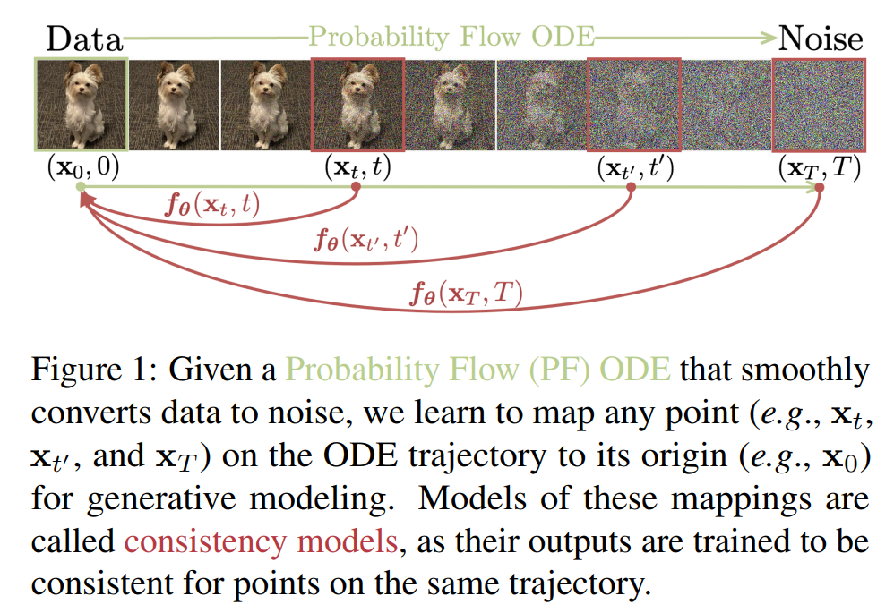

# Consistency Models
Unofficial Implementation of Consistency Models in Pytorch



## Abstract
Diffusion models have made significant breakthroughs in image, audio, and video generation,
but they depend on an iterative generation process
that causes slow sampling speed and caps their
potential for real-time applications. To overcome
this limitation, we propose consistency models,
a new family of generative models that achieve
high sample quality without adversarial training.
They support fast one-step generation by design,
while still allowing for few-step sampling to trade
compute for sample quality. They also support
zero-shot data editing, like image inpainting, colorization, and super-resolution, without requiring explicit training on these tasks. Consistency
models can be trained either as a way to distill
pre-trained diffusion models, or as standalone generative models. Through extensive experiments,
we demonstrate that they outperform existing distillation techniques for diffusion models in oneand few-step generation. For example, we achieve
the new state-of-the-art FID of 3.55 on CIFAR10 and 6.20 on ImageNet 64 ˆ 64 for one-step
generation. When trained as standalone generative models, consistency models also outperform
single-step, non-adversarial generative models on
standard benchmarks like CIFAR-10, ImageNet
64 ˆ 64 and LSUN 256 ˆ 256

[](https://arxiv.org/abs/2303.01469)


## Getting Started
To train a model under Consistency Training (CT) setting.
```
python main.py --cfg config.yml
```

To generate samples and to calculate FID,
```
python generate.py --cfg config.yml --ckpt your-ckpt.ckpt --calc_fid=True
```

Modify ```data.py``` to add new datasets. 

Modify ```config.yml``` to change training parameters and loss functions.

```sampler.py``` contains the multi-step consistency sampler code.

## Single Step Results on CIFAR-10 @15K steps

## Todo

- [x] Consistency Training
- [x] LPIPS loss
- [x] CIFAR-10 Testing
- [ ] Consistency Distillation

# License and Acknowledgments
_EMA Code Adapted from [NVIDIA NeMo](https://github.com/NVIDIA/NeMo)  is under `Apache 2.0 license <https://github.com/NVIDIA/NeMo/blob/stable/LICENSE>`_.

_Network source code adapted from [NVIDIA EDM](https://github.com/NVlabs/edm) is licensed under the [Creative Commons Attribution-NonCommercial-ShareAlike 4.0 International License](http://creativecommons.org/licenses/by-nc-sa/4.0/)_.


# Reference

```bibtex
@misc{https://doi.org/10.48550/arxiv.2303.01469,
  doi = {10.48550/ARXIV.2303.01469},
  
  url = {https://arxiv.org/abs/2303.01469},
  
  author = {Song, Yang and Dhariwal, Prafulla and Chen, Mark and Sutskever, Ilya},
  
  keywords = {Machine Learning (cs.LG), Computer Vision and Pattern Recognition (cs.CV), Machine Learning (stat.ML), FOS: Computer and information sciences, FOS: Computer and information sciences},
  
  title = {Consistency Models},
  
  publisher = {arXiv},
  
  year = {2023},
  
  copyright = {arXiv.org perpetual, non-exclusive license}
}
```

```bibtex
@misc{https://doi.org/10.48550/arxiv.2202.00512,
  doi = {10.48550/ARXIV.2202.00512},
  
  url = {https://arxiv.org/abs/2202.00512},
  
  author = {Salimans, Tim and Ho, Jonathan},
  
  keywords = {Machine Learning (cs.LG), Artificial Intelligence (cs.AI), Machine Learning (stat.ML), FOS: Computer and information sciences, FOS: Computer and information sciences},
  
  title = {Progressive Distillation for Fast Sampling of Diffusion Models},
  
  publisher = {arXiv},
  
  year = {2022},
  
  copyright = {arXiv.org perpetual, non-exclusive license}
}
```